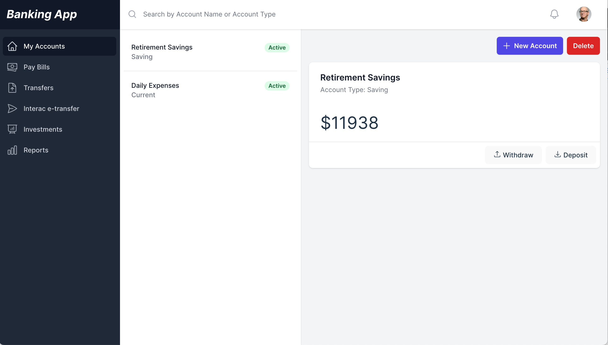
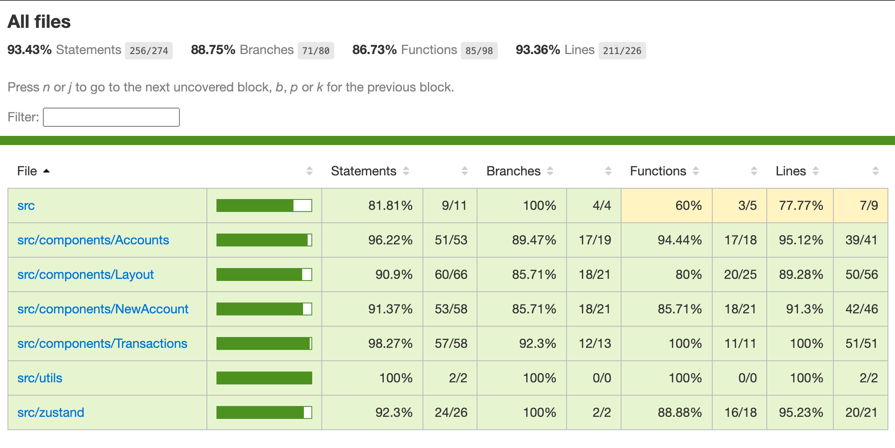

# Basic Banking App



## Live Deployment

App is currently deployed at: https://banking-app-pink.vercel.app/

## Basic Bank system requirements

- A user can have as many accounts as they want.
- A user can create and delete accounts.
- A user can deposit and withdraw from accounts.
- An account cannot have less than $100 at any time in an account.
- A user cannot withdraw more than 90% of their total balance from an account in a single transaction.
- A user cannot deposit more than $10,000 in a single transaction.

## Tech Stack

- Vite: a fast and lightweight build tool for modern web applications
- ReactJS: a popular JavaScript library for building user interfaces
- Typescript: a typed superset of JavaScript that compiles to plain JavaScript
- Tailwind CSS: a utility-first CSS framework for rapid UI development
- TailwindUI: a set of prebuilt components for rapid UI development with Tailwind CSS
- HeadlessUI: a lightweight library of accessible and customizable UI components
- Zustand: a small and fast state management library for ReactJS
- Sonner: a simple and flexible notification library for ReactJS
- Cypress: a popular testing framework for E2E testing
- Istanbul: a JavaScript code coverage tool for measuring test coverage

## Additional Features

- User is able to create two types of accounts -> Checking & Saving
- User data is presisted across sessions in the LocalStorage
- User is able to search through the bank accounts by name or type of account
- Simple notifications are provided to the user to let them know of a successful withdrawal or deposit 


## Starting the development server

```
yarn dev
```

## E2E Tests

For running the e2e tests using cypress, please make sure the development server is running at port 3000 and then run the following command:

```
yarn cy:open-e2e
```

To run the Cypress in headless mode, please use the below command:

```
yarn cy:run-e2e
```

### Code coverage

Code coverage will be generated upon each e2e test run, and can be viewed at `coverage/Icov-report/index.html`

Latest Code Coverage Report


